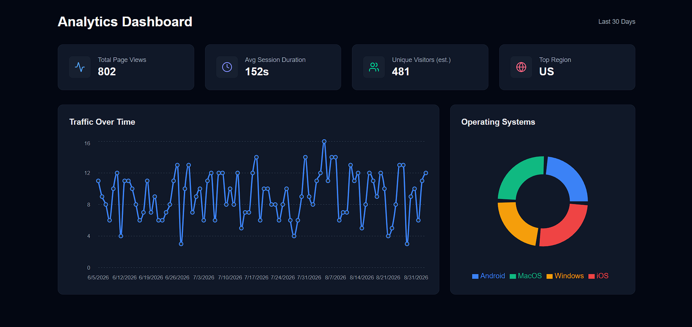

# 📊 Timescale Analytics Platform

A high-performance, self-hosted web analytics and event ingestion platform powered by **FastAPI**, **TimescaleDB**, and **Next.js 15**.

Designed for developers who want lightweight, privacy-conscious, and real-time product metrics without relying on third-party tracking services.

---

<!-- DASHBOARD PREVIEW / SCREENSHOT PLACEHOLDER -->
<p align="center">
  
</p>
<p align="center">
  <em>Interactive dark-mode analytics dashboard visualizing traffic trends, visitor metrics, and platform breakdown.</em>
</p>

---

## ⚡ Highlights

- 🚀 **High-Throughput Ingestion**: Built on **FastAPI** with asynchronous background tasks for non-blocking event processing.
- ⏱️ **Time-Series Supercharged**: Stores events in **TimescaleDB** hypertables with automated 1-day chunk partitioning and retention policies.
- 🌐 **Instant Analytics Tracking**: Includes a lightweight tracking script (`analytics.js`) using `navigator.sendBeacon` for zero impact on user experience.
- 📈 **Modern Interactive Dashboard**: Built with **Next.js 15 (App Router)**, **React 19**, **Tailwind CSS**, and **Recharts**.
- 🌍 **Automated Geolocation**: Resolves visitor countries and cities from client IP addresses in the background.
- 🛡️ **Rate Limiting & Security**: API key authentication and endpoint rate limiting via **SlowAPI**.
- 🎲 **Mock Data Generator**: Built-in synthetic data seeder powered by **Faker** to simulate traffic patterns over 90 days.
- 📦 **Monorepo Architecture**: Managed with **Turborepo** and **pnpm workspaces**.

---

## 🏗️ Architecture & Tech Stack

```
ana_api/
├── apps/
│   ├── api/                   # FastAPI backend & database layer
│   │   ├── alembic/           # Database migration scripts
│   │   ├── src/
│   │   │   ├── api/           # Routing, config, and models
│   │   │   ├── public/        # Client tracking script (analytics.js)
│   │   │   ├── main.py        # FastAPI application entrypoint
│   │   │   └── seed.py        # Mock data generation script
│   │   ├── Dockerfile.web     # Docker container definition
│   │   └── pyproject.toml     # Python dependencies managed with uv
│   └── web/                   # Next.js frontend dashboard
│       ├── src/
│       │   ├── app/           # App Router pages & layout
│       │   └── components/    # Recharts & UI KPI components
│       └── package.json
├── compose.yaml               # Docker Compose configuration (API + TimescaleDB)
├── turbo.json                 # Turborepo task pipeline configuration
└── package.json               # Root workspace configuration
```

### Tech Stack

| Layer | Technologies |
| :--- | :--- |
| **Frontend** | Next.js 15, React 19, Tailwind CSS, Recharts, TanStack Query, Lucide Icons |
| **Backend** | FastAPI, Pydantic v2, SQLModel / SQLAlchemy, SlowAPI |
| **Database** | TimescaleDB (PostgreSQL 17 extension for time-series data) |
| **Tooling** | Turborepo, pnpm, uv (Python packaging), Docker Compose, Alembic |

---

## 🚀 Quick Start

### Prerequisites

Make sure you have installed:
- [Docker & Docker Compose](https://docs.docker.com/get-docker/)
- [Node.js](https://nodejs.org/) (v18+) and [pnpm](https://pnpm.io/)
- [Python](https://www.python.org/) 3.13+ and [uv](https://docs.astral.sh/uv/) (optional, for local development outside Docker)

---

### 1. Clone & Setup Environment

Clone the repository and prepare your environment files:

```bash
git clone https://github.com/your-username/your-repo-name.git
cd your-repo-name

# Copy root environment variables
cp .env.example .env

# (Optional) Copy web dashboard environment variables
cp apps/web/.env.example apps/web/.env.local
```

### 2. Start Services via Docker Compose

Run the TimescaleDB database and FastAPI backend:

```bash
docker compose up -d --build
```

The services will be available at:
- **API Backend**: [http://localhost:8000](http://localhost:8000)
- **API Documentation (Swagger UI)**: [http://localhost:8000/docs](http://localhost:8000/docs)
- **TimescaleDB**: `localhost:5432`

---

### 3. Apply Migrations & Seed Data

Initialize the database schema with Alembic and populate mock analytics data:

```bash
# Apply database migrations
cd apps/api
uv run alembic upgrade head

# Seed 500+ realistic mock events (over a 90-day period)
uv run python src/seed.py
cd ../..
```

---

### 4. Start the Frontend Dashboard

Install workspace dependencies and start the Next.js development server:

```bash
# Install dependencies across all packages
pnpm install

# Start the dashboard in development mode
pnpm run dev
```

Open [http://localhost:3000](http://localhost:3000) in your browser to view the analytics dashboard!

---

## 📡 Web Tracking Integration

To track page views on any website, include the tracking script hosted by your API:

```html
<script src="http://localhost:8000/static/analytics.js" defer></script>
```

The script automatically collects:
- Current pathname (`window.location.pathname`)
- Referrer (`document.referrer`)
- Anonymized session ID (`sessionStorage`)
- User Agent string

Events are dispatched via `navigator.sendBeacon()` or `fetch()` with `keepalive: true` to ensure zero performance degradation.

---

## 🔑 Environment Variables

### Root Configuration (`.env`)

| Variable | Default Value | Description |
| :--- | :--- | :--- |
| `PORT` | `8000` | Port for the FastAPI server |
| `DATABASE_URL` | `postgresql+psycopg://username:password@db_service:5432/timescaledb` | Connection string for TimescaleDB |
| `POSTGRES_USER` | `username` | Postgres database user |
| `POSTGRES_PASSWORD` | `password` | Postgres database password |
| `POSTGRES_DB` | `timescaledb` | Database name |
| `API_KEY` | `super_secret_api_key` | Secret key used for authenticating analytics queries |

### Web Configuration (`apps/web/.env.local`)

| Variable | Default Value | Description |
| :--- | :--- | :--- |
| `NEXT_PUBLIC_API_URL` | `http://localhost:8000/api/events/` | API endpoint for fetching aggregated events |
| `NEXT_PUBLIC_API_KEY` | `super_secret_api_key` | API key matching backend settings |

---

## 🛠️ Available Scripts

From the repository root:

- `pnpm dev`: Runs all applications in development mode simultaneously.
- `pnpm build`: Builds all applications for production.
- `pnpm lint`: Runs ESLint across the codebase.
- `pnpm format`: Formats TypeScript and Markdown files with Prettier.

---

## 📄 License

This project is licensed under the MIT License - feel free to modify and use it for personal and commercial projects.
